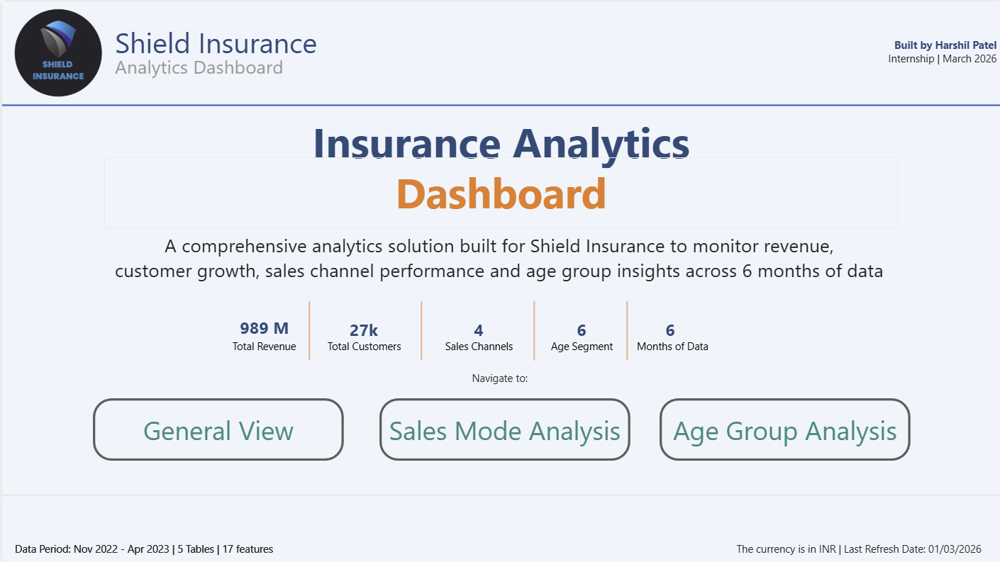
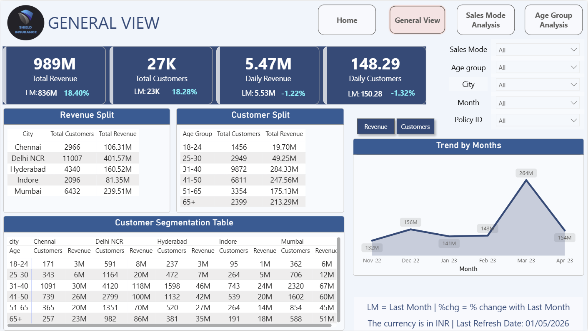
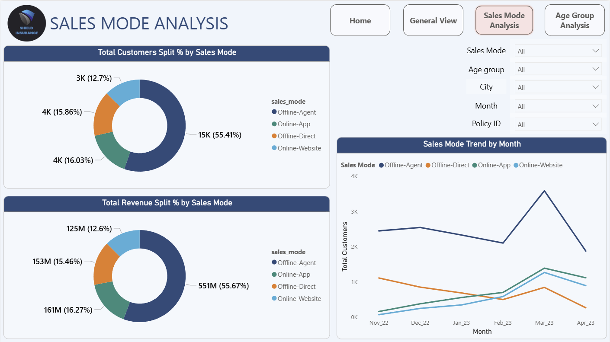
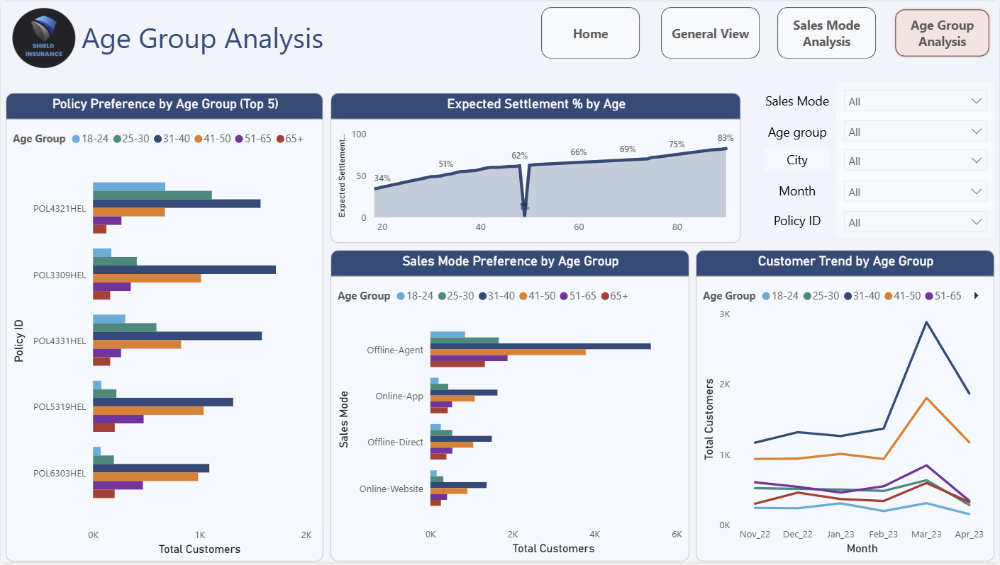

<div align="center">



# 🛡️ Shield Insurance — Analytics Dashboard

### From Raw Data to Business Decisions

*A complete, end-to-end Power BI analytics project built for a fictional insurance client —*
*covering the full professional workflow from client brief to live interactive dashboard.*

<br/>

[](https://powerbi.microsoft.com/)
[](https://learn.microsoft.com/en-us/dax/)
[](https://python.org)
[](https://microsoft.com/excel)
[](https://www.mysql.com/)

[]()
[]()
[](https://AtliQ.io)

</div>

---

## 📌 Table of Contents

- [Project Overview](#-project-overview)
- [The Business Problem](#-the-business-problem)
- [Project Workflow](#-project-workflow)
- [The Data](#-the-data)
- [Data Model](#-data-model)
- [DAX Measures](#-dax-measures)
- [Dashboard Walkthrough](#-dashboard-walkthrough)
- [Key Business Insights](#-key-business-insights)
- [Tech Stack](#-tech-stack)
- [Repository Structure](#-repository-structure)
- [How to Use](#-how-to-use)
- [Key Learnings](#-key-learnings)
- [About Me](#-about-me)

---

## 🔍 Project Overview

Shield Insurance is a fictional insurance provider used as a case study in the **AtliQ Virtual Internship** program (designed by Dhaval Patel and Hemanand Vadivel).

The goal: build a professional, interactive Power BI dashboard that helps business leadership answer their most critical questions — without touching a single spreadsheet.

| Metric | Value |
|--------|-------|
| 📅 Data Period | November 2022 – April 2023 |
| 👥 Total Customers | 27,000+ |
| 💰 Total Revenue | ₹989 Million |
| 📊 Dashboard Pages | 3 |
| ⚙️ DAX Measures Created | 18 |
| 🔧 Features Delivered | 17 |

---

## 🎯 The Business Problem

Shield Insurance had data — but no visibility into it. Their leadership team was asking three critical questions every week, and getting no clean answers:

> **"How is our revenue trending, and are we growing month-over-month?"**

> **"Which cities and age groups are driving our business?"**

> **"Which of our 4 sales channels is performing best — and is that changing?"**

Without a centralized analytics solution, answers required hours of manual Excel work, were inconsistent across teams, and arrived too late to drive decisions.

This project solves all three — with a live, filterable dashboard that updates automatically.

---

## 🔄 Project Workflow

This project followed a **professional analytics delivery process** — no shortcuts.

```
📧 Client Email           →   17 features extracted from requirements
        ↓
📋 Feature List           →   Prioritized (High / Low) with comments
        ↓
🎨 Dashboard Mockup       →   3-page wireframe built & sent for approval
        ↓
✅ Client Approval        →   Feedback incorporated, sign-off received
        ↓
📐 DAX Metrics List       →   18 measures planned before touching Power BI
        ↓
🏗️ Power BI Build         →   3-page live dashboard with real data
        ↓
📄 Documentation          →   User guide PPTX for client handover
        ↓
🎤 Presentation           →   10-slide story deck for YouTube & LinkedIn
```

> **Why this matters:** Most junior analysts jump straight to building. Planning the feature list, getting mockup approval, and designing all DAX measures *before* building is what separates professional delivery from amateur dashboard work.

---

## 📂 The Data

Five CSV files forming a Star Schema:

| Table | Type | Key Columns | Purpose |
|-------|------|-------------|---------|
| `dim_customer` | Dimension | customer_code, dob, city | Customer demographics |
| `dim_date` | Dimension | date, mmm_yy, day_type, week_no | Time intelligence |
| `dim_policies` | Dimension | policy_id, base_cover, base_premium | Policy catalog |
| `fact_premiums` | Fact | date, customer_code, policy_id, sales_mode, final_premium | Core transactions |
| `fact_settlements` | Standalone | age, settlement% | Risk / actuarial data |

### ⚠️ Data Quality Issue Encountered & Resolved

Power BI auto-detected the `settlement%` column as a **Percentage** data type and multiplied all values by 100 — turning `34.15%` into `3415%`.

**Fix:** Changed the column data type to **Decimal Number** in Power Query before loading, preserving the correct values.

---

## 🗃️ Data Model

```
                    ┌─────────────┐
                    │  dim_date   │
                    │  (date)     │
                    └──────┬──────┘
                           │ 1:*
┌──────────────┐    ┌──────┴───────┐    ┌───────────────┐
│ dim_customer │────│ fact_premiums│────│  dim_policies │
│(customer_code│ *:1│              │1:* │  (policy_id)  │
└──────────────┘    └─────────────┘    └───────────────┘

┌──────────────────┐
│ fact_settlements │  ← Standalone (no relationship)
│ (age, settle%)   │     Used independently in Age Group page
└──────────────────┘
```

---

## ⚙️ DAX Measures

All 18 measures were planned in advance in a dedicated **Measures table**.

<details>
<summary><strong>📐 Calculated Columns (2)</strong></summary>

```dax
-- Age of each customer in years
Age = DATEDIFF(dim_customer[dob], TODAY(), YEAR)

-- Age group bucket for segmentation
Age Group =
SWITCH(
    TRUE(),
    dim_customer[Age] >= 18 && dim_customer[Age] <= 24, "18-24",
    dim_customer[Age] >= 25 && dim_customer[Age] <= 30, "25-30",
    dim_customer[Age] >= 31 && dim_customer[Age] <= 40, "31-40",
    dim_customer[Age] >= 41 && dim_customer[Age] <= 50, "41-50",
    dim_customer[Age] >= 51 && dim_customer[Age] <= 65, "51-65",
    dim_customer[Age] > 65, "65+",
    "Unknown"
)
```
</details>

<details>
<summary><strong>📊 Core Measures (5)</strong></summary>

```dax
Total Revenue = SUM(fact_premiums[final_premium_amt(INR)])

Total Customers = DISTINCTCOUNT(fact_premiums[customer_code])

No of Days = DATEDIFF(MIN(dim_date[date]), MAX(dim_date[date]), DAY) + 1

Daily Revenue = DIVIDE([Total Revenue], [No of Days])

Daily Customers = DIVIDE([Total Customers], [No of Days])
```
</details>

<details>
<summary><strong>📅 Last Month Measures (4)</strong></summary>

```dax
Revenue LM = CALCULATE([Total Revenue], DATEADD(dim_date[date], -1, MONTH))

Customers LM = CALCULATE([Total Customers], DATEADD(dim_date[date], -1, MONTH))

Daily Revenue LM = CALCULATE([Daily Revenue], DATEADD(dim_date[date], -1, MONTH))

Daily Customers LM = CALCULATE([Daily Customers], DATEADD(dim_date[date], -1, MONTH))
```
</details>

<details>
<summary><strong>📈 MoM % Change Measures (4)</strong></summary>

```dax
Revenue % Change (MoM) = DIVIDE([Total Revenue] - [Revenue LM], [Revenue LM])

Customers % Change (MoM) = DIVIDE([Total Customers] - [Customers LM], [Customers LM])

Daily Revenue Growth % = DIVIDE([Daily Revenue] - [Daily Revenue LM], [Daily Revenue LM])

Daily Customer Growth % = DIVIDE([Daily Customers] - [Daily Customers LM], [Daily Customers LM])
```
</details>

<details>
<summary><strong>📉 Split & Settlement Measures (3)</strong></summary>

```dax
Revenue Split % =
DIVIDE([Total Revenue], CALCULATE([Total Revenue], ALL(fact_premiums)))

Customers Split % =
DIVIDE([Total Customers], CALCULATE([Total Customers], ALL(fact_premiums)))

Expected Settlement % = AVERAGE(fact_settlements[settlement %])
```
</details>

---

## 📊 Dashboard Walkthrough

### 🏠 Home Page — Navigation Hub


The home page provides a high-level snapshot (989M revenue, 27K customers, 4 channels, 6 months) and navigation buttons to each analytical page. Designed so non-technical stakeholders can immediately orient themselves.

---

### 📋 Page 1 — General View



**What it answers:**
- How much revenue and customers do we have total?
- How did we grow compared to last month?
- Which cities and age groups drive the most business?
- What does our revenue and customer trend look like over 6 months?

**Features:**
- 4 KPI cards with LM (Last Month) and MoM % change
- Revenue Split table by City
- Customer Split table by Age Group
- Customer Segmentation Matrix (City × Age Group)
- Trend chart with Revenue / Customer toggle switch
- 5 dropdown filters: Sales Mode, Age Group, City, Month, Policy ID

---

### 📊 Page 2 — Sales Mode Analysis



**What it answers:**
- Which sales channel brings in the most customers and revenue?
- What percentage of total business does each channel represent?
- How is each channel trending month over month?

**Features:**
- Donut chart: Total Customers split % by Sales Mode
- Donut chart: Total Revenue split % by Sales Mode
- Line chart: Sales Mode Trend by Month (all 4 channels)

---

### 👥 Page 3 — Age Group Analysis



**What it answers:**
- Which age groups prefer which policies?
- What is the expected settlement risk by age?
- How do different age groups prefer to buy (sales mode)?
- How is each age group growing over time?

**Features:**
- Bar chart: Policy Preference by Age Group (Top 5)
- Line chart: Expected Settlement % by Age (actuarial risk curve)
- Grouped bar: Sales Mode Preference by Age Group
- Multi-line trend: Customer count by Age Group over 6 months

---

## 💡 Key Business Insights

> *These are the 5 insights that Shield Insurance's leadership should act on immediately.*

**1. 📈 Revenue is growing — but the pace is slowing**
Overall MoM growth is +18.4%, but daily revenue dipped -1.22%. Growth was front-loaded in March and didn't sustain into April. Leadership should investigate the March driver and build a strategy to replicate it.

**2. 🏙️ Delhi NCR is the revenue capital**
Delhi NCR generates ₹401M in revenue with 11,007 customers — significantly ahead of every other city. Marketing budgets and agent deployment should be concentrated here first.

**3. 🎯 The 31-40 age group is the golden segment**
This group leads every metric: most customers, highest revenue, broadest policy preference, and highest activity across all sales channels. Retention and product development should prioritize this segment.

**4. 📱 Offline-Agent dominates — but digital is accelerating**
55% of revenue comes from agents. However, online channels spiked sharply in March and are trending upward. Digital infrastructure investment today will pay dividends as this shift continues.

**5. ⚠️ 65+ settlement rate demands a pricing review**
At 83% expected settlement, this age group carries the highest actuarial risk. Premium structures for customers aged 65+ should be reviewed against risk models to ensure long-term sustainability.

---

## 🛠️ Tech Stack

| Tool | Role | Version |
|------|------|---------|
| **Power BI Desktop** | Dashboard & Visualization | Latest |
| **DAX** | 18 Measures + 2 Calculated Columns | — |
| **Power Query (M)** | Data Cleaning & Transformation | — |
| **Python** | Mockup generation, PDF assets, background image | 3.11+ |
| **MySQL** | Data modeling concepts & Star Schema design | 8.0 |
| **Excel** | Feature List, DAX Metrics List | Microsoft 365 |
| **pptxgenjs** | Programmatic presentation generation | 3.x |
| **ReportLab** | PDF mockup generation | 4.x |

---

## 📁 Repository Structure

```
shield-insurance-analytics/
│
├── 📄 README.md
│
├── 📂 data/
│   ├── The data files are confidential
│
├── 📂 docs/
│   ├── feature_list.xlsx          ← 17 features with priority & comments
│   ├── dax_metrics_list.xlsx      ← All 18 measures with DAX formulas
│   └── client_updated_mockup.pdf  ← Client feedback mockup
│
├── 📂 documentation/
│   └── shield_insurance_report ← User guide for client
│
└── 📂 screenshots/
        ├── home_page.png
        ├── general_view.png
        ├── sales_mode.png
        └── age_group.png
```

---

## 🚀 How to Use

### View the Dashboard
1. Download `dashboard/shield_insurance.pbix`
2. Open with [Power BI Desktop](https://app.powerbi.com/view?r=eyJrIjoiNDgzMWU2MzAtNTNmOC00ZjljLWE5N2EtMWZkOTYzMWZhZTAyIiwidCI6ImM2ZTU0OWIzLTVmNDUtNDAzMi1hYWU5LWQ0MjQ0ZGM1YjJjNCJ9) (free)
3. The data is embedded — no database connection needed
4. Use the filters on each page to explore the data

### Explore the Documentation
- `docs/feature_list.xlsx` — See how client requirements were structured
- `docs/dax_metrics_list.xlsx` — All DAX formulas with descriptions
- `presentation/shield_insurance_presentation.pptx` — Full project walkthrough
- `documentation/shield_insurance_documentation.pptx` — Client-facing user guide

### Reproduce the Data Model
1. Load all 5 CSV files from `/data/` into Power BI Desktop
2. In Power Query: change `settlement %` data type to **Decimal Number**
3. In Model view: create relationships as described in [Data Model](#️-data-model)
4. Add all measures from `docs/dax_metrics_list.xlsx`

---

## 📚 Key Learnings

These are the real, transferable skills this project developed:

**Analytics Process**
- Translating unstructured client emails into a formal, prioritized feature list
- Building dashboard mockups before writing a single measure — and why this saves time
- Getting client sign-off at the design stage, not the build stage

**Power BI & DAX**
- Star Schema design for insurance/transactional data
- Time intelligence with `DATEADD` for LM (Last Month) comparisons
- `DIVIDE` with `ALL()` for context-independent split percentages
- Sorting text-based date columns (`mmm_yy`) using `YEAR*100+MONTH` to preserve chronological order across multiple years
- Bookmark + Button pattern for Revenue / Customer toggle switches
- Page navigation buttons for a professional user experience

**Data Quality**
- Power BI's auto-detection of Percentage data type causes ×100 multiplication on decimal columns — always verify in Power Query before loading
- Always cross-check calculated metrics (e.g., Daily Revenue × Days ≈ Total Revenue) to validate measure logic

**Data Storytelling**
- The difference between reporting numbers and surfacing actionable insights
- Structuring a presentation as a business narrative, not a feature demo
- Using color, layout, and hierarchy to guide the reader's eye

---

## 🇳🇱 About Me

**Harshil Patel** — Data Analytics professional based in the Netherlands, targeting roles in Supply Chain, FMCG, and Logistics domains.

This project is part of the **AtliQ Virtual Internship** — a structured, real-world analytics program designed by industry practitioners.

**I'm actively looking for data analyst opportunities in the Netherlands.**
If you're hiring or want to connect — let's talk.

<div align="center">

[](https://www.linkedin.com/in/harshil-patel-188b2274/)
[](https://github.com/HP85-NL)
[](mailto:harshil.patel150@gmail.com)

</div>

---

<div align="center">

*Built with ❤️ as part of the AtliQ Virtual Internship*
*Designed by Dhaval Patel & Hemanand Vadivel*

⭐ **If this project helped you, consider giving it a star!** ⭐

</div>
